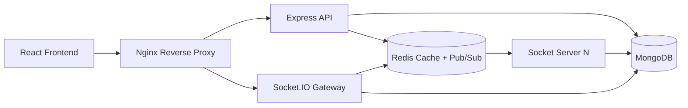

# Wire: Distributed Real-Time Chat Platform

Wire is a full-stack, production-oriented chat platform that demonstrates how to design and ship a scalable real-time communication system.

It combines a React frontend, an Express + Socket.IO backend, MongoDB for persistence, Redis for distributed socket fanout, and Nginx for reverse proxy routing.

## Why This Project Stands Out

- Built with a scalability-first architecture instead of a single-node demo setup.
- Demonstrates clean backend layering (routes, controllers, services, repositories, models).
- Includes health checks, structured logging, rate limiting, and security middleware.
- Ships with Docker and Docker Compose for reproducible local and deployment-ready environments.
- Shows testing intent with auth route integration tests and roadmap-driven engineering.

## Recruiter-Friendly Summary

This project highlights practical backend and full-stack engineering skills:

- Designed and implemented authentication flows with access/refresh token handling.
- Implemented real-time event architecture with Socket.IO and Redis adapter support for horizontal scaling.
- Structured the codebase for maintainability using clear service and repository boundaries.
- Containerized frontend, backend, and infrastructure services for consistent deployment.
- Documented architecture, socket flow, deployment, and roadmap to support team onboarding.

## System Architecture



## Tech Stack

- Frontend: React 19, Redux Toolkit, React Router, Tailwind CSS, Vite
- Backend: Node.js, Express, Socket.IO, Joi, JWT, Winston
- Data and Messaging: MongoDB, Redis, Socket.IO Redis adapter
- Ops: Docker, Docker Compose, Nginx
- Testing: Jest, Supertest

## Monorepo Structure

```text
front/
	backend/      # Express API + Socket.IO
	frontend/     # React + Vite app
	docs/         # Architecture, API, deployment, roadmap
	nginx/        # Reverse proxy configuration
```

## Core Features

- User registration, login, refresh token rotation, logout
- Real-time socket events for message delivery and read state
- Health endpoint with Mongo and Redis readiness checks
- Security and resilience: CORS, Helmet, rate limiter, structured logs
- Ready for distributed scaling with Redis Pub/Sub + socket adapter

## How A Recruiter Can View The Output

Use one of these paths depending on what you have deployed:
1. Open the live demo URL in a browser and walk through the dashboard, auth flow, and docs page.
2. If the app is only running locally, start the stack with Docker Compose and open the frontend through Nginx on port 8080.
3. If login is required, provide temporary demo credentials in the README and remove them after review.
4. Add screenshots or a short screen recording that shows registration, login, and the real-time UI.
5. Link the deployment guide so a recruiter can reproduce the environment if needed.

Recommended repo additions for recruiters:

- Live Demo: add your deployed frontend URL here
- API: add your deployed backend URL here
- Demo Credentials: add temporary credentials here if needed
- Screenshots: add 3 to 5 images of the dashboard, auth flow, and docs page

## Live Demo Deployment Plan

Recommended stack for a recruiter-friendly public demo:

- Frontend: Vercel
- Backend: Render
- Database: MongoDB Atlas
- Cache / pub-sub: Redis Cloud

Deployment order:

1. Provision MongoDB Atlas and Redis Cloud.
2. Deploy the backend as a Docker service on Render.
3. Deploy the frontend on Vercel and point it to the backend URL.
4. Add the live URLs to this README.
5. Verify login, health, and socket connectivity from the public site.

Add your final links here:

- Live Frontend: <add-url>
- Backend API: <add-url>
- Demo Credentials: <add-temporary-demo-login-if-needed>
- Screenshots: <add-links-or-store-under-docs>

## Local Development

### Prerequisites

- Node.js 20+
- Docker and Docker Compose

### Run with Docker Compose (Recommended)

From the repository root:

```bash
docker compose up --build
```

Services:

- Nginx: http://localhost:8080
- Backend API: http://localhost:4000
- Frontend container: http://localhost:80

### Run Without Docker

1. Start MongoDB and Redis locally.
2. Create `backend/.env` and configure values.
3. Install dependencies and run both apps:

```bash
# backend
cd backend
npm install
npm run dev

# frontend (new terminal)
cd ../frontend
npm install
npm run dev
```

## Environment Variables (Backend)

Example values:

```env
NODE_ENV=development
PORT=4000
MONGO_URI=mongodb://localhost:27017/wire
REDIS_URL=redis://localhost:6379
JWT_ACCESS_SECRET=access-secret
JWT_REFRESH_SECRET=refresh-secret
JWT_ACCESS_EXPIRES_IN=15m
JWT_REFRESH_EXPIRES_IN=7d
CORS_ORIGIN=http://localhost:5173,http://localhost:8080
```

## API Overview

- POST /api/auth/register
- POST /api/auth/login
- POST /api/auth/refresh
- POST /api/auth/logout
- GET /health

## Testing

Backend auth route wiring test:

```bash
cd backend
npm test
```

## Documentation

- docs/demo-guide.md
- docs/architecture.md
- docs/api.md
- docs/socket-flow.md
- docs/deployment-guide.md
- docs/roadmap.md

## Suggested Resume Talking Points

- Engineered a distributed real-time chat platform using React, Express, Socket.IO, Redis, and MongoDB.
- Improved production readiness with security middleware, health checks, structured logging, and containerized deployment.
- Designed for horizontal scale by integrating Redis Pub/Sub with Socket.IO server fanout.
- Applied clean architecture principles to keep domain logic testable and maintainable.

## License

This project is intended for portfolio and educational use. Add your preferred open-source license if publishing publicly.
