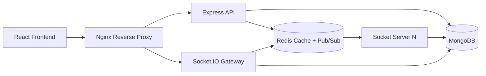

# System Architecture

## Design Decisions

- Clean Architecture keeps controllers thin and business logic in services.
- Redis Pub/Sub and the Socket.IO adapter synchronize presence and messages across nodes.
- MongoDB is the system of record for users, conversations, messages, groups, notifications, and refresh tokens.
- Nginx terminates and routes HTTP and WebSocket traffic.
