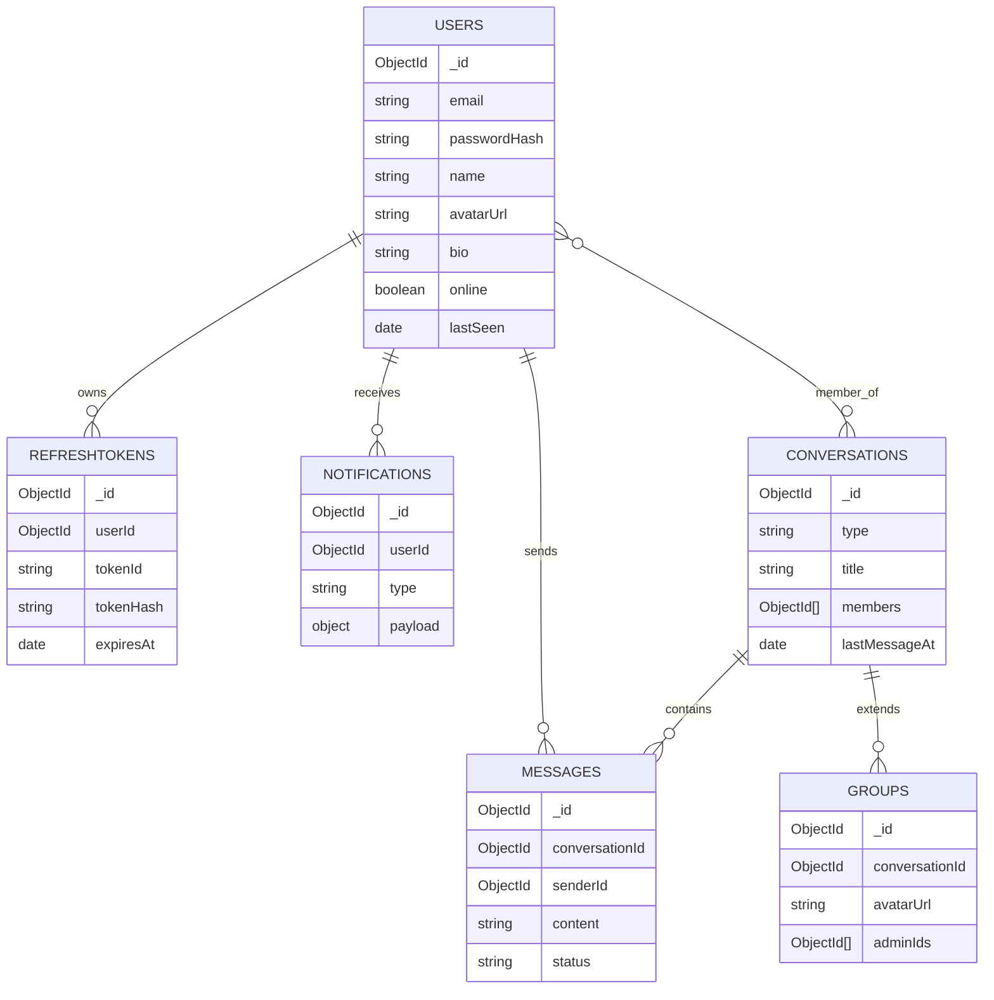

# Database Schema

```mermaid
erDiagram
  USERS ||--o{ REFRESHTOKENS : owns
  USERS ||--o{ MESSAGES : sends
  USERS ||--o{ NOTIFICATIONS : receives
  CONVERSATIONS ||--o{ MESSAGES : contains
  CONVERSATIONS ||--o{ GROUPS : extends
  USERS }o--o{ CONVERSATIONS : member_of

  USERS {
    ObjectId _id
    string email
    string passwordHash
    string name
    string avatarUrl
    string bio
    boolean online
    date lastSeen
  }
  CONVERSATIONS {
    ObjectId _id
    string type
    string title
    ObjectId[] members
    date lastMessageAt
  }
  MESSAGES {
    ObjectId _id
    ObjectId conversationId
    ObjectId senderId
    string content
    string status
  }
  GROUPS {
    ObjectId _id
    ObjectId conversationId
    string avatarUrl
    ObjectId[] adminIds
  }
  NOTIFICATIONS {
    ObjectId _id
    ObjectId userId
    string type
    object payload
  }
  REFRESHTOKENS {
    ObjectId _id
    ObjectId userId
    string tokenId
    string tokenHash
    date expiresAt
  }
```
