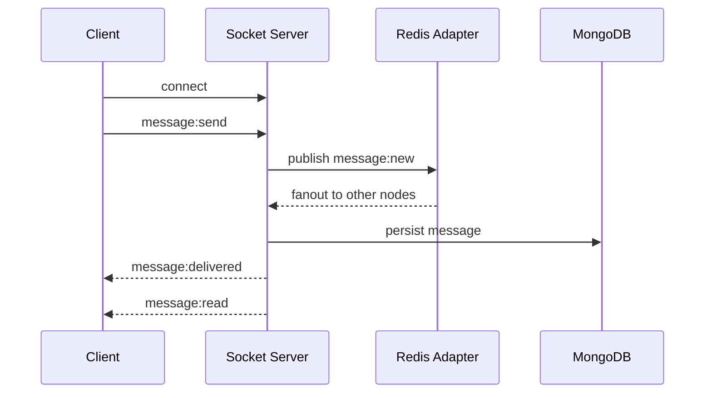

# Socket.IO Flow

```mermaid
sequenceDiagram
  participant C as Client
  participant S as Socket Server
  participant R as Redis Adapter
  participant M as MongoDB

  C->>S: connect
  C->>S: message:send
  S->>R: publish message:new
  R-->>S: fanout to other nodes
  S->>M: persist message
  S-->>C: message:delivered
  S-->>C: message:read
```
